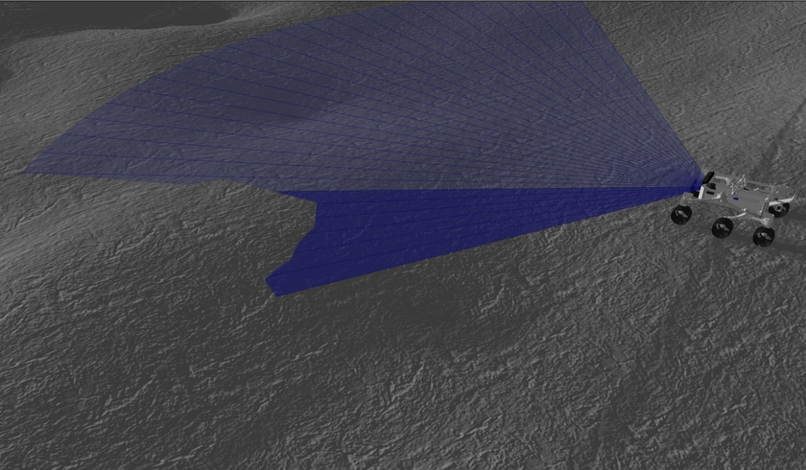
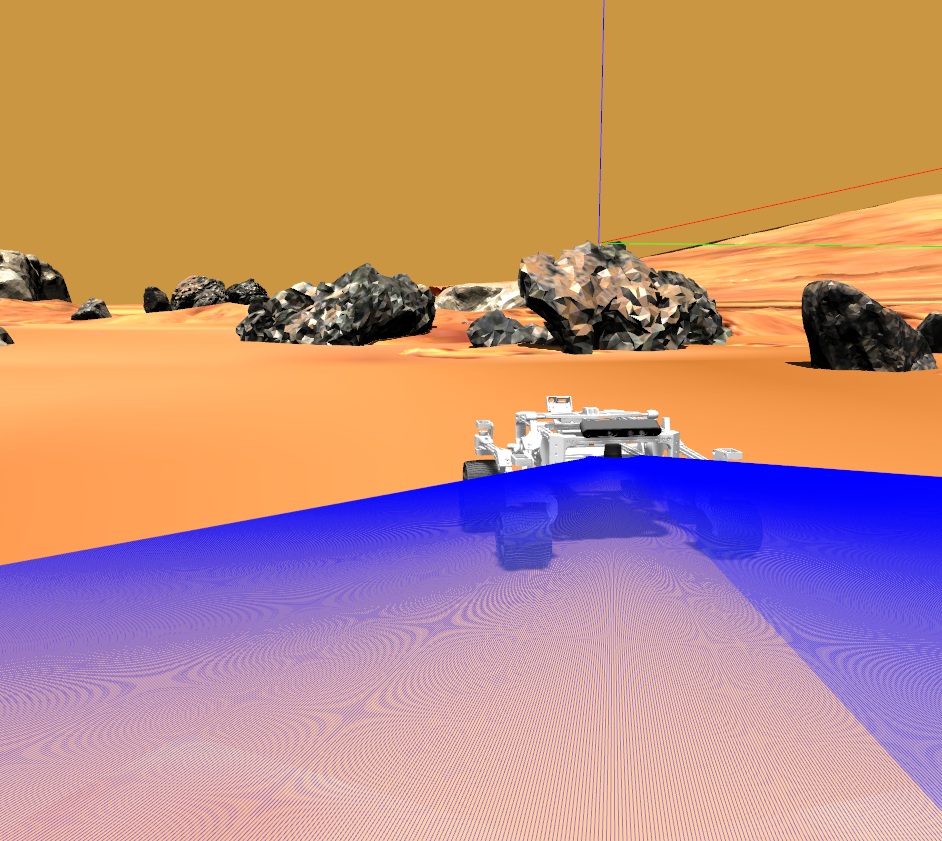

# Space_Exploration_Rover
Space Exploration Rover is an open-source robotics project designed to simulate and develop planetary rover autonomy using ROS 2 and Gazebo. The project provides a modular and extensible framework for simulating a six-wheeled space rover in diverse extraterrestrial environments such as the Moon and Mars - like terrains.

## Table of Contents

1. [Installation](#installation)
2. [Gazebo Simulation](#gazebo-simulation)

## Installation

```shell
cd ~/ros2_ws/src
git clone < https >
cd ~/ros2_ws
rosdep install --from-paths src -r -y
colcon build
```
## Gazebo Simulation

### Moon

```shell
ros2 launch rover_gazebo moon.launch.py
```

<div>
    
</div>

### Mars

```shell
ros2 launch rover_gazebo mars.launch.py
```

<div>
    
</div>


